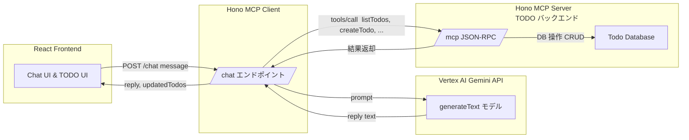

# architecture

```mermaid
flowchart LR
  subgraph FE [React Frontend]
    A[Chat UI & TODO UI]
  end

  subgraph Client [Hono MCP Client]
    B[/chat エンドポイント/]
  end

  subgraph Gemini [Vertex AI Gemini API]
    C[generateText モデル]
  end

  subgraph Server [Hono MCP Server<br/>TODO バックエンド]
    D[/mcp JSON-RPC/]
    DB[Todo Database]
  end

  A -->|POST /chat  message | B
  B -->|prompt| C
  C -->|reply text| B
  B -->|tools/call  listTodos, createTodo, ... | D
  D -->|DB 操作 CRUD| DB
  D -->|結果返却| B
  B -->| reply, updatedTodos | A

```